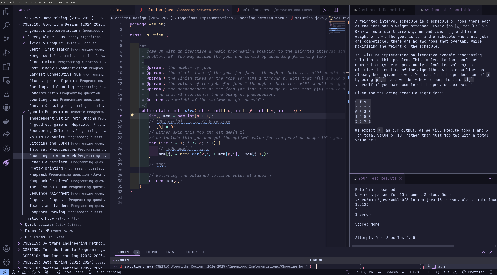

# WebLab for Visual Studio Code
Tired of using the default WebLab editor? Me too! This extension brings the WebLab environment right into Visual Studio Code.



## Disclaimer
This extension is not affiliated with WebLab in any way. It is a personal project and is not endorsed by WebLab.

Because WebLab is closed-source, this extension uses some 'questionable' methods to make WebLab work within VS Code. It runs WebLab in a headless Chromium browser and uses Playwright to retrieve, modify and send data to the WebLab editor. This means that the extension is not very stable and may break at any time, and may use a significant amount of system resources.

## Features
Some notable features include:
- Sidebar: Find all your courses, assignments and files in the WebLab sidebar
- File structure: Auto import solution code to your file system, whilst keeping the WebLab file structure
- Auto login: It saves your credentials in the VSC secret storage, so you don't have to login every time (I don't know how secure this is)
... with all the benefits of VS code.

## Installing

> [!WARNING]
> If you do not install the playwright prerequisites, the extension will not work.

Install the playwright prerequisites (you specifically need version 1.38.0) using NPM:
```sh
npx playwright@1.38.0 install
```

<details>
<summary>Installing for NixOS</summary>

### Installing for NixOS

For NixOS, I recommend using the [shell.nix](shell.nix) and [.envrc](.envrc) in combination with direnv

The reason this is required for NixOS is because certain header library files are needed, which shell.nix provides.
</details>


## Known Issues
- The extension is not very stable and may break at any time

Please let me know :)


## Roadmap
- WebLab Library support: Emulates the given WebLab libraries in the editor
- See issues


## Questions

'' Why no Intellij plugin? ''
A: Because VSC extensions looked much easier at first glance.

## Developing
1. Install VS Code and pnpm
2. Clone this git repo
3. in this repository, run ````pnpm i````